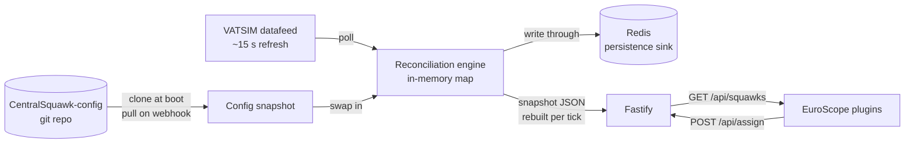
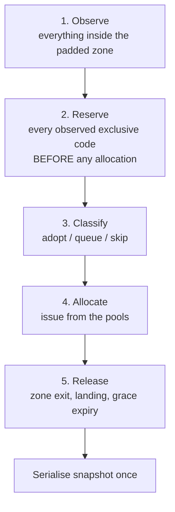

# Architecture

CentralSquawk is the single authority for SSR code assignment across the French
FIRs. It ingests the VATSIM datafeed, decides every code, and serves a map of
`callsign -> {ssr, dupe}` to EuroScope plugins that perform no calculation of
their own.

The behavioural specification — what the rules *are* — lives in the
[CentralSquawk plugin README](https://github.com/AlexisBalzano/CentralSquawk).
This document is about how the service is built.

## Shape

Everything about the airspace is ingested, not compiled in: FIR polygons, ORCAM
pools, exclusion lists, zone geometry and navdata all come from the config
repository. The container image carries no airspace knowledge at all.

## Runtime topology

**One instance per world.** The reconciliation loop is single-writer by
construction, and running two against the same world would mean two schedulers
allocating from pools they each believe they own. Coordination was considered
and rejected: at 60 controllers polling a ~2.4 KiB gzipped snapshot, load is a
rounding error, and leader election would be pure risk for no throughput.

A restart costs a brief `503` while the warm-up ticks run. That is deliberate,
not a defect — see *Warm-up* below.

### Feed source, and the simulator instance

`FEED_SOURCE` decides where observations come from:

| Value | Behaviour |
| --- | --- |
| `vatsim` (default) | Polls the datafeed. Production. |
| `push` | Does not poll at all. A client supplies the picture on `POST /api/feed`. |

A sweatbox has no datafeed behind it, so a simulator session has to describe
itself. It runs as **a second instance of this same image** with
`FEED_SOURCE=push`. Which instance a plugin talks to is settled below, and not
by asking EuroScope.

The two instances may share one Redis. The map is persisted under a key derived
from the mode — `centralsquawk:assignments` live, `sweatbox:centralsquawk:assignments`
push — so neither restores the other's state on restart. That derivation goes
through `env.feedSource` and falls through to the **live** key, because
production does not set `FEED_SOURCE` at all: a key read raw from the
environment would put a live server on the simulator's key, and its next
restart would restore a sweatbox session's aircraft into the live map holding
real codes. `test/persistence-key.test.ts` pins it. Two *simulator* instances on
one Redis would share a key; a second one needs its own.

#### The connection type is not the boundary

The obvious design is for the plugin to read EuroScope's connection type and
pick a server. It does read it, but it cannot be trusted alone: EuroScope
reports `SWEATBOX` only for the machine **running** the session. A student joins
a sweatbox by connecting normally and picking the training server, which
EuroScope reports as `DIRECT`, identically to VATSIM. The participants who do
the assigning are exactly the ones it gets wrong, and a plugin that trusted it
would seed sweatbox aircraft into the live map and hold real ORCAM codes for
them.

So the boundary is enforced here, where the answer is actually knowable. The
datafeed lists every controller logged on, so **`/api/assign` refuses any
callsign the roster does not contain** (`not_on_network`, 403). It does not
depend on the client being right about anything, which is the point:
`test/network-gate.test.ts` pins it.

Two properties make that safe to run:

- **The roster is held, not cleared,** when a feed carries none. A generation we
  failed to fetch says nothing about who is logged on, and dropping it would
  refuse every controller in the country.
- **Absent and empty are different.** `controllers: undefined` means "cannot
  judge" and refuses nobody, which is what a push-mode instance and a cold start
  both are. An empty set means "nobody is controlling", which is an answer.

`GET /api/network?controller=…` publishes the same fact unauthenticated — who is
logged on is in the datafeed already — so a plugin can point itself at the right
server before a controller needs a code rather than after being turned away.

Isolation is the whole reason it is also a separate instance rather than a flag
threaded through the engine. Sim traffic sharing the live pool would consume
real ORCAM codes and raise DUPEs against real aircraft, and sweatbox callsigns
collide with live ones by design. Making it a deployment fact means
`POST /api/feed` **is not registered at all** on a production instance: there is
no route there to send anything to, whatever anybody sends. `test/feed-disabled.test.ts`
pins that.

Both modes run the identical `ingest` path — tick, persist, mark the feed alive —
so the engine never learns which mode it is in. Only two things differ:

- **Warm-up defaults to 0.** Warm-up exists because a first datafeed generation
  can arrive partial. A pushed feed never is: the client sends the whole picture
  or nothing. Waiting would only open a session with half a minute of `503`.
- **`generatedAt` is stamped server-side**, never taken from the payload. Every
  age the tick computes is measured against it, so a client whose clock is
  minutes off would otherwise expire or preserve the map wholesale.

**The feeder lease.** Every EuroScope in a sweatbox sees the same traffic, so
without arbitration they would all push and the map would be rebuilt several
times a tick from pictures that disagree about who is where. The first client to
push claims the lease; everyone else gets `409 not_the_feeder` naming the holder.
It renews on every push and is taken over only once stale (`FEEDER_LEASE_SEC`,
default 45), which makes an instructor whose EuroScope crashes a few seconds of
degradation rather than the end of the session. A displaced client still sends
the **whole** picture when it probes for the lease — winning it with an empty
push would tick the engine against an empty world and start the grace clock on
every flight in the session.

## Module map

| Path | Responsibility |
| --- | --- |
| `src/index.ts` | Bootstrap, poll loop, graceful shutdown |
| `src/env.ts` | Process environment. Operational knobs only |
| `src/server.ts` | Fastify instance and every route |
| `src/auth.ts` | Controller token and GitHub webhook signature |
| `src/geo.ts` | Point-in-polygon, distance to an area's outline, `Area` |
| `src/config/schema.ts` | Config shape and its validator |
| `src/config/loader.ts` | Assembles a whole snapshot, all-or-nothing |
| `src/domain/types.ts` | Domain types |
| `src/domain/codes.ts` | Code classification |
| `src/domain/pools.ts` | Per-FIR ORCAM pools, reservation, allocation |
| `src/domain/observation.ts` | Parses and sanitises client-supplied observations |
| `src/navdata/navdata.ts` | Parsers for `fix.txt`, `airway.txt`, `procedure.txt` |
| `src/navdata/modes.ts` | Mode S eligibility, route tokeniser, route cache |
| `src/engine/engine.ts` | The reconciliation tick and manual operations |
| `src/vatsim/datafeed.ts` | Datafeed fetch, narrowing, and the controller roster |
| `src/store/redis.ts` | Persistence sink |

## The reconciliation tick

The loop is **reconciliation-based, not event-based**: every tick rebuilds the
intended state from the datafeed and the current map. Cold start is therefore
not a special mode, it is the same loop with an empty prior — which is what
makes traffic already airborne inside the AOR at startup behave correctly with
no separate bootstrap path.

**Phase order is load-bearing.** Phase 2 reserves every code an aircraft is
actually transmitting before phase 4 allocates anything. Allocating while
iterating would let the pool hand out a code that an aircraft later in the same
pass is already squawking — a DUPE the server invented itself. On a cold start
with 300 aircraft this is not a rare race; it is close to certain.

Within phase 2, reality wins twice over:

1. Codes observed on the wire are reserved first, whoever we think owns them.
2. Our own assignments are reserved second. One that loses its code to an
   aircraft actively squawking it yields and is queued for a fresh code.

That ordering is what implements "an actively squawked code always beats an
assigned one".

The tick is idempotent: running it twice against the same feed produces no
changes on the second pass. This is worth preserving — it is the cheapest
possible check that the loop has no hidden state.

### The border band

The plugin writes the central code into any flight nobody is tracking. That is
right for a flight in French airspace and wrong for one a neighbouring unit is
still working, and low traffic near the boundary is mostly the second kind.
Geneva's runway is 0.2 NM outside the AOR, so without a guard its departures
were given a French code on the takeoff roll, and every French plugin wrote it
into them while Geneva was still handing them from tower to approach.

So a new flight enters scope on one of two terms, depending on where it is:

| Layer | Where | Enters scope when |
| --- | --- | --- |
| Core | Inside the AOR by at least `borderInsetNm` | Airborne, as before |
| Border band | From there out to `entryRingNm` | Airborne, and at or above `borderMinAltitudeFt` |

It gates adoption as well as allocation, because an adopted code is published
and written just the same. It remembers nothing: a held flight is asked again
every tick and enters scope the tick it climbs through the floor or crosses into
the core, so the tick stays idempotent. `held=` on the tick line, and
`lastTick.heldAtBorder` on `/health`, count the flights it kept out.

What it deliberately leaves alone:

- **A flight already in the map.** The band decides entry, not release. A French
  departure descending towards a foreign aerodrome keeps its code until it lands
  or leaves the padded zone.
- **Observation.** Held flights are inside the padded zone, so the codes they
  squawk are still reserved in phase 2 and they still take part in DUPE
  detection. That is why the gate sits in phase 3.
- **A controller's request.** Manual operations are never gated.

**The inset is measured from the outline of the AOR, not from the nearest ring
edge.** `config.aor.firs` matches the five FIRs *and* the France UIR, which
carries the id `LFFF` too, so most FIR edges are seams through the middle of the
country. Measured to those, Clermont-Ferrand sits 7 NM from the border rather
than 118, and its departures would be held at any inset above that. `Area` cuts
every ring edge wherever another crosses or joins it, and keeps the pieces with
the inside on one side and the outside on the other. From outside that is
exactly the distance it always measured; from inside it is the depth into
France. It is built on first use, in about 15 ms on the real geometry.

### Warm-up

`WARMUP_CYCLES` (default 2) datafeed cycles are observed before the first
allocation, so the first sweep runs against a complete picture rather than a
partial feed. Until the first full sweep completes, `GET /api/squawks` answers
`503`.

`503` was chosen over adding a `stale` field precisely so the payload contract
stays exactly `{callsign: {ssr, dupe}}`. Clients keep their last snapshot and
retry; nothing has to learn a new shape for a transient condition.

### Client seeds

A controller asks for a code the moment a pilot connects, which is a datafeed
cycle or more before the feed carries them. The plugin therefore attaches the
flight as the feed would have described it -- EuroScope received the same flight
plan over the same FSD connection -- as an optional `flight` object on
`POST /api/assign`.

It is **not** a second lifecycle. The seed is held in `Engine.seeded` and merged
into phase 1 as an ordinary observation, on exactly the same terms as the feed's
own, so reserve, classify, allocate, release and DUPE need to know nothing about
where an observation came from. That merge is also the whole of "forget the seed
once the flight is real": a seed whose callsign the feed now carries is dropped
rather than merged.

Four properties keep it from being a hole in the authority model:

1. **The datafeed always wins.** A seed for a callsign already observed is
   ignored outright, not merged and not recorded.
2. **The reported transponder is discarded** and replaced with `0000`. Phase 2
   reserves every observed exclusive code before allocating, so a code taken on
   a client's word would let any client drain the pool one claim at a time and
   manufacture DUPEs against real traffic. A controller adopting the code an
   aircraft really is squawking sends it as `code` instead, through the ordinary
   manual path.
3. **Position is validated against the padded zone**, so a seed cannot conjure a
   flight into an airspace it is nowhere near.
4. **`SEED_MAX_PER_CONTROLLER`** caps how many unconfirmed seeds one controller
   may hold, so a buggy or hostile plugin has a bounded blast radius.

An unconfirmed seed is released at `SEED_TTL_SEC` rather than on top of the
grace period. The grace period exists so a flight that really was there can
reconnect onto its code; a seed the feed never confirmed never was, and holding
its code for five further minutes only strands it.

## Mode S eligibility

Two independent halves:

- **Equipment.** ICAO field 10b must contain one of `EHILS`, the set CCAMS uses
  in production. `P` and `X` are excluded: they are Mode S but carry no aircraft
  identification, which conspicuity operation depends on.
- **Geography.** Every point of the route must lie inside the Mode S area.

### Containment is resolved at build time

`fix.txt` ships already clipped to the Mode S polygon, so **membership in
`fix.txt` is the containment test**. The service never runs point-in-polygon on
a route point; it does a hash lookup. `modes_area.geojson` is loaded only to
derive the AOR and for health reporting.

`airway.txt` is deliberately *not* clipped. An airway that leaves the area and
returns would, if clipped, look contiguous and wrongly qualify the flight.
Unclipped, its excursion survives as fixes that `airway.txt` names and `fix.txt`
does not contain, so expansion hits an unresolvable point and fails closed.

### The tokeniser

1. Skip `DCT` and speed/level groups (`N0450F350`).
2. Skip tokens published as a SID or STAR by this flight's **own** departure or
   destination aerodrome. Matching a bare designator against every airport would
   wrongly skip the six identifiers that are both a procedure name and a real
   in-area fix: `BRAVO`, `HON`, `NORTH`, `ROCIO`, `SOUTH`, `TSC`.
3. Expand airway tokens between the fix before and the fix after. A designator
   may be published as disjoint segments, so the chain containing both endpoints
   wins. A token that cannot be expanded denies 1000.
4. Every remaining token must appear in `fix.txt`.

Anything unresolved denies 1000. "Outside the area" and "not in our data" are
indistinguishable here, and both should yield a discrete code.

### Route cache

Verdicts are cached against the route text (`departure|route|arrival`), not the
callsign: the same city pairs are filed with identical routes all day, so a
route-keyed cache hits far more often. The equipment half is evaluated per
flight on top.

**The cache is cleared on every config swap.** A verdict is only valid for the
navdata that produced it, and an AIRAC that moves an airway or retires a fix
changes the answer for routes whose text has not changed at all. Nothing would
look wrong; the service would simply serve stale eligibility forever.

## Codes and pools

Only **discrete** codes are exclusive. Every other class is shared by design —
several aircraft may legitimately squawk `7000`, `1000` or `7700` at once — so
those codes are never reserved against a pool and never raise a DUPE.

| Class | Issued | Reserved | DUPE |
| --- | --- | --- | --- |
| Discrete (ORCAM pools) | yes | yes | yes |
| Default (`0000` `1200` `1234` `2000` `7000`) | no | no | no |
| Conspicuity (`1000`) | when eligible | no | no |
| Emergency (`7500` `7600` `7700`) | no | no | no |
| Excluded (per-FIR list) | no | no | yes |

### One national pool, allocated by destination

The pool comes from `ssr_pool.json`, generated from the EUROCONTROL Code
Allocation List. Two things about the CAL shape the allocator:

**It allocates to LF nationally, not per FIR.** Only four ranges name a specific
French unit (all LFMM). There is therefore one pool rather than five, and no
entry-FIR ownership: splitting the national allocation across the FIRs would
have been our invention rather than something EUROCONTROL published.

**It allocates by destination.** `0401-0477` may only be issued to flights
landing in France, `7440-7477` only to flights bound for the UK, Ireland or
North America, and only some ranges carry `ALL`. Destinations are ICAO prefixes
of one, two or four characters, matched against the arrival aerodrome.

Allocation therefore takes the flight's destination and prefers **the most
specific matching range**, so any-destination ranges are held back for traffic
that has no specific allocation. Of 1,812 issuable codes only 402 are
any-destination, so spending them on flights that had a specific range available
would strand everyone else. A flight with no filed destination can only draw
from an any-destination range.

Allocation is round-robin within a range so a released code is not immediately
reissued. Exhaustion is reported per destination rather than outright: running
out means no range serving *that* destination has a free code.

The CAL is an allocation table, not a policy statement — a range can span a
conspicuity or emergency code, and nothing in the file prevents it. The loader
folds the default, conspicuity and emergency codes into the pool's exclusions,
so `1000`, `7000` and `7700` can never be handed out as discrete codes even
where a range covers them.

Reservations are rebuilt from scratch every tick. That is what makes
reserve-before-allocate enforceable rather than merely intended.

## Config ingestion

`init-config.sh` clones the config repository into `/app/data` at boot. The
`POST /api/config-webhook` endpoint verifies the GitHub HMAC signature against
the raw request bytes, pulls in place, and asks the engine to reload.

**Validation is all-or-nothing.** `loadConfigSnapshot` parses and validates
everything — `config.json`, the polygon, all three navdata files — into a new
object, and only a fully valid result is swapped in. A rejected push returns
`422` and leaves the running snapshot untouched. A bad config must never be able
to stop code assignment.

Two checks in the validator are worth knowing about because they catch silent
failures rather than loud ones:

- `zonePaddingNm` must exceed `entryRingNm`. Without a gap, an aircraft can
  cross the release boundary and immediately re-enter scope, churning its code.
- `config.aor.firs` must match at least one feature in the polygon. Otherwise
  the AOR is empty, nothing is ever in scope, and the service runs happily while
  assigning nothing.

Startup is the one place a bad config is fatal: there is nothing to fall back
to, and serving an empty map as though it were real is worse than not starting.

For local work, `CONFIG_SKIP_FETCH=1` bypasses fetching entirely and uses
`CONFIG_DIR` as supplied, which `docker-compose.local.yml` pairs with a
read-only bind mount of a config checkout on the host. The read-only flag is not
decoration: the fetch path runs `git reset --hard`, and pointing that at a
bind-mounted working tree would discard uncommitted work.

## HTTP surface

| Route | Purpose |
| --- | --- |
| `GET /health` | Status, navdata cycle, pool utilisation, last tick stats |
| `GET /logs` | Plain-text decision log. `?q=` filters, `?lines=` limits |
| `GET /api/squawks` | The snapshot. gzip. `503` until the first sweep completes |
| `POST /api/assign` | Manual set-code or force-reassign, answered synchronously. Optional `flight` seeds a callsign the datafeed has not reached |
| `GET /api/network` | Whether a controller callsign is logged on to this network. Unauthenticated |
| `POST /api/feed` | The whole picture, for a simulator session. **Only registered when `FEED_SOURCE=push`** |
| `POST /api/config-webhook` | HMAC-verified config reload |

The snapshot is serialised **and gzipped once per tick**, not per request. Sixty
controllers polling every five seconds against a fifteen-second tick means the
same pair of buffers is served roughly one hundred and eighty times over, so
compressing per request would be that much CPU spent producing a byte-identical
result. Serving either encoding is a buffer write; the route picks one from
`Accept-Encoding` and sets `Vary`.

Measured on live traffic: 2874 bytes raw, 700 gzipped, 4.1x.

### Datafeed phase locking

The feed regenerates every 15.000 s, but a generation only becomes fetchable
some seconds after the timestamp it carries -- VATSIM's own processing and CDN
propagation, measured at 22 s one morning and 11 s the same afternoon. Nothing
on this side shortens that.

What polling does control is the extra 0-15 s spent waiting to notice a new
generation, and a fixed `setInterval` controls it badly. Our period and VATSIM's
are both 15.000 s, so every poll returns exactly one new generation whatever the
phase: the offset a container happens to boot with is held for the whole
session, and an unlucky start reads the stalest possible feed every single tick
for hours.

So the poller schedules from the feed's own timestamp instead. It tracks the
shortest gap it has seen between a generation's timestamp and catching it, and
aims each poll just past when the next one should land. Finding that edge needs
a probe -- a fixed period never produces a duplicate, whatever the phase -- so
until it is found each poll creeps slightly earlier than the last. The first
duplicate IS the edge: it proves the generation had not yet arrived, which
brackets the delivery delay to within one creep step. From there the creep drops
out and the phase simply holds.

A duplicate after locking means delivery has slipped, and nudges the estimate
back up. Without that the estimate could only ever fall, and a single unusually
fast generation would leave the poller early -- and duplicating -- for good.

In practice it locks within a few ticks and then sits within a second of each
arrival, which shows up in the tick line as `askLagMs` holding steady. Steady
state costs one request per generation, the same 4/min as before; probes add a
handful during convergence and one per slip after it.

`/logs` serves an in-memory ring buffer, separate from pino. pino goes to the
container's stdout, where an operator looks; `/logs` is for the controller who
wants to know why the flight in front of them got 7201 rather than 1000 and has
no shell on the box. Every discrete assignment therefore carries the reason
conspicuity was refused -- the one piece of information that exists nowhere else
once a code has been drawn from the pool. The buffer holds the last 4000 lines,
sized so a cold start (one line per flight already in scope) still leaves hours
of ordinary traffic behind it.

`/health` reports `degraded` when Redis is down or the engine is still warming,
and `unhealthy` (`503`) when config is missing or the datafeed has gone stale.
Redis is a persistence sink, not a dependency of assignment, so losing it must
not read as an outage.

## Persistence

The map is authoritative in process; Redis exists so a restart resumes exactly
rather than losing every manual override. Redis being unavailable is degraded,
not fatal — the reconciliation sweep rebuilds a correct map from the datafeed on
its own, and the only thing genuinely lost is provenance: manual flags decay to
`adopted`.

## Invariants

Break any of these and the service will still appear to work.

1. **Reserve before allocate, every tick.** Manufactured DUPEs otherwise.
2. **Clear the route cache on config swap.** Stale eligibility otherwise, with
   no visible symptom.
3. **Only discrete codes are reserved and DUPE-checked.** Treating shared codes
   as exclusive lights up most of the traffic on a busy evening.
4. **A manual assignment is protected from the loop.** Provenance is the only
   thing standing between a controller's decision and the scheduler.
5. **Validate the whole config before swapping.** Half-applied config is worse
   than rejected config.
6. **The tick is idempotent.** If a second pass over the same feed changes
   anything, there is hidden state.
7. **A client seed is never trusted with a transponder.** It is the one path by
   which a client writes into the authoritative map, and a trusted code there
   defeats invariant 1 from the outside. A *pushed* observation is trusted with
   one, and may only ever be, because `FEED_SOURCE=push` is a separate instance
   with a separate pool and no real traffic to collide with.
8. **`POST /api/feed` exists only in push mode.** Isolation between the
   simulator and the live world is structural. The moment it becomes a runtime
   check inside the engine, it is one missed branch away from sim traffic
   holding real codes.
9. **The live instance refuses a callsign it cannot see on the network.** This
   is the only barrier that does not rely on a client knowing which world it is
   in, and EuroScope cannot tell it: a student on a sweatbox reports `DIRECT`.
   Anything that weakens this — trusting a client's claim about its own mode,
   failing open when the roster is missing — puts invented traffic in the real
   map holding real codes.
10. **The border band gates classification, never observation.** A held flight
    must stay in the observation set. Filtered out in phase 1, the code it is
    squawking would no longer be reserved, and the pool would hand it to
    someone else: a DUPE the server invented.

## Known gaps

- **Two CAL ranges are dead capacity.** `3510-3537` and `7470-7477` are destined
  to FIR identifiers (`LFMM`, `EDGG`) rather than aerodrome prefixes, so nothing
  matches them without aerodrome-to-FIR resolution. `7470-7477` also overlaps
  `7440-7477` and loses its codes to it.
- **Roughly half the French allocation is unusable by design.** 1,825 codes are
  shared across the EUR-B participating area and cannot be issued unilaterally.
  Using them would need real-time coordination with the other states.
- **Auth is the accepted-weak scheme.** `SHA256(secret + callsign)` with the
  secret compiled into a distributed DLL. Recorded as an accepted risk.
- **Identifier collisions.** Around 915 identifiers are reused among in-area
  fixes; name-based resolution will occasionally judge a point inside because a
  same-named fix elsewhere is. This biases toward granting 1000, the opposite
  direction from every other fail-closed choice here.
- **Delegated airspace deeper than the inset.** The Channel Islands sit inside
  the Brest FIR polygon (EGJJ 44 NM in, EGJB 27 NM), so Jersey's departures are
  core traffic and still get a code on the takeoff roll. No sane inset reaches
  them; they would need a carve-out of their own.
- **French aerodromes in the band are held like foreign ones.** An inset of
  2 NM or more puts LFSB and LFLI in the band, and 10 NM adds LFST, LFQQ, LFGA
  and LFKF. Their departures wait for the floor, or for a controller to ask.
- **No tests yet.** The tick's idempotence and the reserve-before-allocate
  ordering are the two things most worth covering first.
